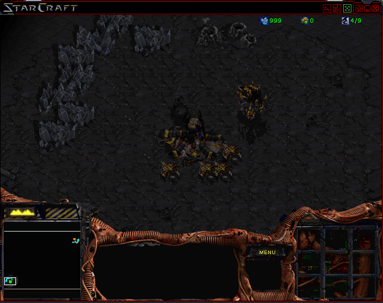

# Injecting DLLs
I didn't use a DLL injector for this but used AppInit_DLLs based on this guide [here](https://gamehacking.academy/pages/3/03/#injecting-dlls)  
The DLL I created is also based on the code in the guide above but adapted for brood war 1.16.1.  
When the player presses M, the DLL will add 999 minerals to their mineral count.  
```c++
#include <Windows.h>

void injected_thread() {
    while (true) {
        if (GetAsyncKeyState('M')) {
            DWORD* player_num = (DWORD*)0x57F0B0;
            (*player_num)--;
            DWORD* min = (DWORD*)(*player_num*4 + 0x57F0F0);
            *min = 999;
        }

        Sleep(1);
    }
}

BOOL WINAPI DllMain(HINSTANCE hinstDLL, DWORD fdwReason, LPVOID lpvReserved) {
    if (fdwReason == DLL_PROCESS_ATTACH) {
        CreateThread(NULL, 0, (LPTHREAD_START_ROUTINE)injected_thread, NULL, 0, NULL);
    }

    return true;
}
```
I tested this with chaos launcher and the minerals are added but the screen fades and starcraft crashes afterwards.  
I'll have to figure what the issue is.  

