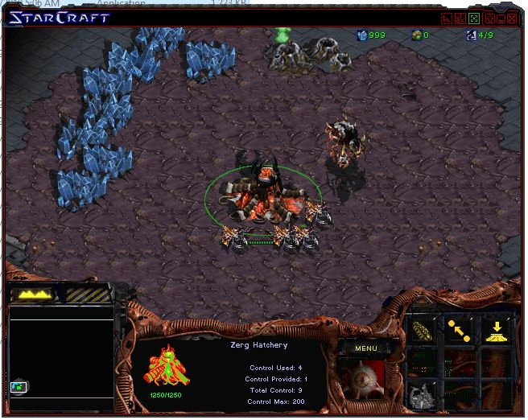

# Injecting DLLs
I didn't use a DLL injector for this but used AppInit_DLLs based on this guide [here](https://gamehacking.academy/pages/3/03/#injecting-dlls)  
The DLL I created is also based on the code in the guide above but adapted for brood war 1.16.1.  
The code was tested with Visual Studio 2019 on Windows 10.  
When the player presses M, 999 minerals will be added to their mineral count.  
```c++
#include <Windows.h>

void injected_thread() {
    while (true) {
        if (GetAsyncKeyState('M')) {
            DWORD* player_num = (DWORD*)0x57F0B0;
            DWORD num = *player_num;
            num--; // (*player_num)--; don't want to decrement (*player_num)
            DWORD* min = (DWORD*)(num * 4 + 0x57F0F0);
            *min = 999;
        }

        Sleep(1);
    }
}

BOOL WINAPI DllMain(HINSTANCE hinstDLL, DWORD fdwReason, LPVOID lpvReserved) {
    if (fdwReason == DLL_PROCESS_ATTACH) {
        CreateThread(NULL, 0, (LPTHREAD_START_ROUTINE)injected_thread, NULL, 0, NULL);
    }

    return true;
}
```
I tested this with chaos launcher and the minerals are added after.  


I am working on a Delphi port but am currently only able to confirm that the DLL was injected.  
This code was tested with Delphi 12 on Windows 10.  
```delphi
library Project2;

{$R *.res}

uses
  Windows;

function DllMain(hinstDLL: HINST; fdwReason: DWORD; lpvReserved: Pointer): BOOL; stdcall;
begin
  MessageBox(0, nil, nil, 0);
  Result := True;
end;

exports
  DllMain;

begin
  DllProc := @DllMain;
end.
```